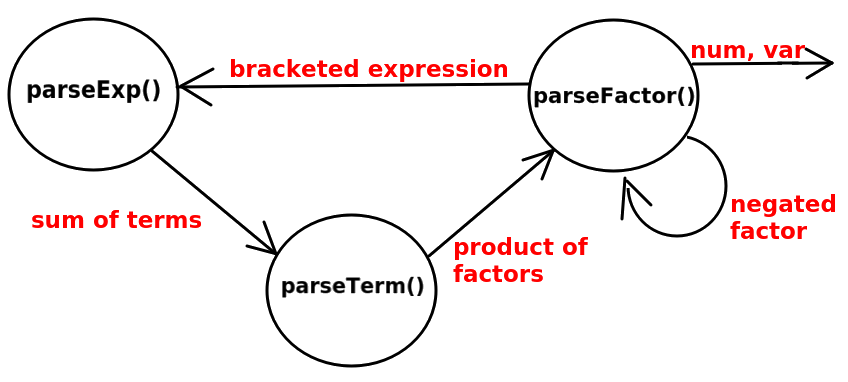

# Cinciarellang

A simple, dinamically typed, c-like, functional programming language.


<a style="font-style : italic;" href="https://en.wikipedia.org/wiki/Eurasian_blue_tit">Eurasian blue tit (Cyanistes caeruleus)</a>

## Running it


## Code Snippets

You can find some examples of this language's usage here.

## Grammar

You can get a semi-formal EBNF specification of this language, which is a stripped down and adapted form of the C programming language grammar.

https://cs.wmich.edu/~gupta/teaching/cs4850/sumII06/The%20syntax%20of%20C%20in%20Backus-Naur%20form.htm


## About the Project

This is the very first time I try implementing a parser for a "real McCoy" programming language, with a technique known as <a href="https://en.wikipedia.org/wiki/Recursive_descent_parser">Recursive Descent</a>; where the trick is to write a bunch of <a href="https://en.wikipedia.org/wiki/Mutual_recursion">mutually recursive</a> functions that repeatedly call each other in a loop (eg: `A` calls `B`, `B` calls `C`, and `C` calls back `A`, etc...). The loop eventually terminates, because function `C` eventually decides to return a base value instead of calling `A`. 


Take mathematical expressions as a simple example of a language:

1. An **Expression** is the topmost structure in the hierarchy, and it is defined as the *sum of one or more **Terms***.
2. A **Term** is defined as the *product of one or more **Factors***.
3. And a **Factor** is a **number**, a **variable**, a **bracketed Expression**, or a **negated Factor**. 

More concisely:

```
E -> E+T | E-T
T -> T*F | T/F
F -> num | var | (E) | -F
```
*(these are known as "production rules").*

Notice how `+` and `-` are the weakest operators (think PEMDAS) so they're used to build up the topmost and most "fragile" structure: the **Expression**; while `*` and `/` are stronger, so they're used to build up the **Term** structure down in the hierarchy.

You may thus implement a recursive trio of functions that behave in such a fashion:




To implement a parser for a full programming language, you basically need to build upon this simple hierarchy to include operators like: `==`, `!=`, `!`, `&&`, `||` and `=` (typically the weakest); in addition to strings, bools, statements, blocks, function calls, dot notation etc ... You can do all of that using this very same Recursive Descent technique. You'll first want to build a tokenizer (aka: lexer) to feed proper tokens to the parser.


The final output of a call to `parseExp()` will be some abstract representation of the parsed expression's hierarchy, typically an <a href="https://en.wikipedia.org/wiki/Abstract_syntax_tree">AST (Abstract Syntax Tree)</a>. For instance, the AST resulting from the assignment expression **`c = 1 + 1`** is:


When you're done with the parser, you may want to build an interpreter for your newly created language; but don't worry: if you don't care about performance, that's the easy part! 


### Sources:
* https://www.youtube.com/watch?v=SToUyjAsaFk
* https://lisperator.net/pltut/
* https://en.wikipedia.org/wiki/Recursive_descent_parser
* https://en.wikipedia.org/wiki/Mutual_recursion
* https://en.wikipedia.org/wiki/Abstract_syntax_tree


